# System Architecture — phz-grid

**Version**: 1.0
**Date**: 2026-02-24
**Status**: Design Phase
**Architect**: Solution Architect

---

## Table of Contents

1. [Architecture Overview](#architecture-overview)
2. [Package Dependency Graph](#package-dependency-graph)
3. [Core Engine Architecture](#core-engine-architecture)
4. [Rendering Architecture](#rendering-architecture)
5. [Data Flow Architecture](#data-flow-architecture)
6. [Accessibility Architecture](#accessibility-architecture)
7. [Collaboration Architecture](#collaboration-architecture)
8. [AI Architecture](#ai-architecture)
9. [Extensibility Architecture](#extensibility-architecture)
10. [Performance Architecture](#performance-architecture)
11. [Technology Stack](#technology-stack)
12. [Deployment Architecture](#deployment-architecture)
13. [Security Architecture](#security-architecture)
14. [Cross-Cutting Concerns](#cross-cutting-concerns)
15. [Shared Infrastructure Package](#shared-infrastructure-package-phozartphz-shared)
16. [Three-Shell Architecture](#three-shell-architecture)
17. [Updated Package Dependency Graph (v15)](#updated-package-dependency-graph-v15)
18. [Engine Subsystems (v15 Additions)](#engine-subsystems-v15-additions)
19. [Workspace Wave 5 States (v15 Additions)](#workspace-wave-5-states-v15-additions)

---

## Architecture Overview

### System Context (C4 Level 1)

```mermaid
graph TB
    subgraph "Developer Environment"
        DEV[Web Developer]
    end

    subgraph "End User Environment"
        USER[End User<br/>Screen Reader, Keyboard, Touch]
    end

    subgraph "phz-grid Ecosystem"
        CORE[@phozart/phz-core<br/>Headless Engine]
        GRID[@phozart/phz-grid<br/>Web Components]
        REACT[@phozart/phz-react]
        VUE[@phozart/phz-vue]
        ANGULAR[@phozart/phz-angular]
        DUCKDB[@phozart/phz-duckdb]
        AI[@phozart/phz-ai]
        COLLAB[@phozart/phz-collab]
    end

    subgraph "External Systems"
        LLM[LLM Providers<br/>OpenAI, Anthropic, Google]
        DATA[Data Sources<br/>CSV, Parquet, JSON, Arrow]
        SYNC[Sync Backends<br/>WebSocket, WebRTC]
    end

    DEV -->|Integrates| REACT
    DEV -->|Integrates| VUE
    DEV -->|Integrates| ANGULAR
    REACT --> GRID
    VUE --> GRID
    ANGULAR --> GRID
    GRID --> CORE

    DUCKDB --> CORE
    AI --> CORE
    COLLAB --> CORE

    USER -->|Interacts| GRID

    DUCKDB -->|Queries| DATA
    AI -->|Tool Use| LLM
    COLLAB -->|Syncs| SYNC

    style CORE fill:#4A90E2
    style GRID fill:#4A90E2
    style DUCKDB fill:#F5A623
    style AI fill:#F5A623
    style COLLAB fill:#F5A623
```

### High-Level Architecture Principles

1. **Headless Core First** — Separation of data/state management from rendering
2. **Zero DOM Dependency in Core** — Core engine runs in Web Workers if needed
3. **Progressive Enhancement** — Core features work without JavaScript enhancements
4. **Accessibility by Design** — Not bolted on, architected from foundation
5. **Framework Agnostic** — Web Components as universal rendering layer
6. **MIT Licensed** — All features are open source under the MIT license
7. **Performance Budget** — <50 KB core bundle, <500 MB memory at 100K rows
8. **ESM-Only** — No CommonJS, leveraging modern module systems

### Container Architecture (C4 Level 2)

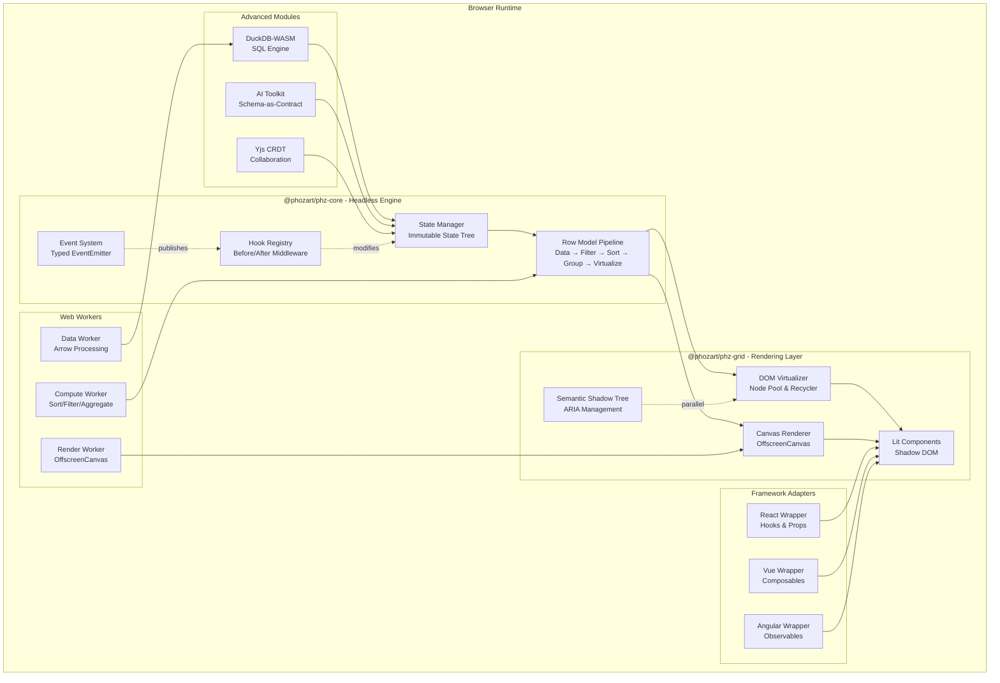

---

## Package Dependency Graph

### Dependency Layers (Strict Layering Rules)

```mermaid
graph TB
    subgraph "Layer 0: Core Engine (No Dependencies)"
        CORE[@phozart/phz-core<br/>Headless State & Logic]
    end

    subgraph "Layer 1: Rendering (Depends on Core)"
        GRID[@phozart/phz-grid<br/>Lit Web Components]
    end

    subgraph "Layer 2: Framework Adapters (Depend on Grid)"
        REACT[@phozart/phz-react]
        VUE[@phozart/phz-vue]
        ANGULAR[@phozart/phz-angular]
    end

    subgraph "Layer 3: Advanced Extensions (Depend on Core)"
        DUCKDB[@phozart/phz-duckdb<br/>WASM SQL Engine]
        AI[@phozart/phz-ai<br/>LLM Integration]
        COLLAB[@phozart/phz-collab<br/>Yjs CRDTs]
    end

    subgraph "Layer 4: Documentation (Depends on All)"
        DOCS[@phozart/phz-docs<br/>VitePress Site]
    end

    GRID --> CORE
    REACT --> GRID
    VUE --> GRID
    ANGULAR --> GRID
    DUCKDB --> CORE
    AI --> CORE
    COLLAB --> CORE
    DOCS --> REACT
    DOCS --> VUE
    DOCS --> ANGULAR
    DOCS --> DUCKDB
    DOCS --> AI
    DOCS --> COLLAB

    style CORE fill:#4A90E2,stroke:#333,stroke-width:3px
    style GRID fill:#7ED321
    style DUCKDB fill:#F5A623
    style AI fill:#F5A623
    style COLLAB fill:#F5A623
```

### Package Responsibilities Matrix

| Package | Responsibility | Public API Surface | Dependencies |
|---------|----------------|-------------------|--------------|
| `@phozart/phz-core` | State management, event system, data model, row pipeline, hooks | `createGrid()`, `GridState`, `EventEmitter`, `registerHook()` | None (zero deps) |
| `@phozart/phz-grid` | Lit components, DOM virtualization, a11y shadow tree, theming | `<phz-grid>`, `<phz-cell>`, `<phz-header>` | `@phozart/phz-core`, `lit@^5.0` |
| `@phozart/phz-react` | React wrapper, hooks, prop mapping | `<PhzGrid>`, `useGridState()`, `useGridApi()` | `@phozart/phz-grid`, `react@^18` |
| `@phozart/phz-vue` | Vue wrapper, composables, reactive bindings | `<PhzGrid>`, `useGrid()` | `@phozart/phz-grid`, `vue@^3` |
| `@phozart/phz-angular` | Angular component, RxJS observables, DI integration | `PhzGridComponent`, `GridService` | `@phozart/phz-grid`, `@angular/core@^17` |
| `@phozart/phz-duckdb` | DuckDB-WASM data source, SQL query engine, Arrow integration | `DuckDBDataSource`, `query()`, `loadParquet()` | `@phozart/phz-core`, `@duckdb/duckdb-wasm@^1.31` |
| `@phozart/phz-ai` | Schema generation, LLM tool-use, NL query parser | `generateSchema()`, `queryFromNL()`, `AIAdapter` | `@phozart/phz-core`, `zod@^3` |
| `@phozart/phz-collab` | Yjs CRDT bindings, awareness, sync adapters | `CollabProvider`, `YjsBinding`, `PresenceManager` | `@phozart/phz-core`, `yjs@^13`, `y-websocket@^2` |
| `@phozart/phz-docs` | Documentation site, live examples, API reference | N/A (docs only) | All packages |

### Strict Layering Rules

1. **Core is Zero-Dependency** — `@phozart/phz-core` MUST NOT depend on any rendering library, framework, or browser API (except Web APIs)
2. **Grid Depends Only on Core + Lit** — `@phozart/phz-grid` MUST NOT depend on React/Vue/Angular
3. **Framework Adapters are Thin Wrappers** — React/Vue/Angular adapters MUST NOT implement grid logic, only prop/event mapping
4. **Advanced Modules Extend Core** — DuckDB/AI/Collab MUST depend on `@phozart/phz-core`, NOT on `@phozart/phz-grid`
5. **No Circular Dependencies** — Enforced via ESLint `import/no-cycle` rule
6. **Peer Dependencies Only** — Framework adapters use peer deps for React/Vue/Angular to avoid version conflicts

---

## Core Engine Architecture

### State Management (Immutable State Tree)

```mermaid
graph TB
    subgraph "GridState (Immutable)"
        DATA[data: RowData[]]
        COLUMNS[columns: ColumnDef[]]
        SORT[sortState: SortModel]
        FILTER[filterState: FilterModel]
        SELECT[selectionState: Set<RowId>]
        VIEWPORT[viewportState: ViewportModel]
        EDIT[editState: EditModel]
    end

    subgraph "State Mutations"
        REDUCER[State Reducer<br/>Pure Functions]
    end

    subgraph "Subscribers"
        SUB1[Grid Component]
        SUB2[Framework Adapter]
        SUB3[Plugin]
    end

    DATA --> REDUCER
    COLUMNS --> REDUCER
    SORT --> REDUCER
    FILTER --> REDUCER
    SELECT --> REDUCER
    VIEWPORT --> REDUCER
    EDIT --> REDUCER

    REDUCER -.emits.-> SUB1
    REDUCER -.emits.-> SUB2
    REDUCER -.emits.-> SUB3
```

#### State Tree Structure

```typescript
interface GridState {
  // Data layer
  data: RowData[];
  rowIdMap: Map<RowId, RowData>;

  // Column configuration
  columns: ColumnDef[];
  columnOrder: ColumnId[];
  columnWidths: Map<ColumnId, number>;
  pinnedColumns: { left: ColumnId[], right: ColumnId[] };

  // Filtering
  filterState: {
    columnFilters: Map<ColumnId, FilterCondition>;
    globalFilter: string | null;
    filteredRowIds: Set<RowId>; // Cached result
  };

  // Sorting
  sortState: {
    sortModel: Array<{ columnId: ColumnId, direction: 'asc' | 'desc' }>;
    sortedRowIds: RowId[]; // Cached result
  };

  // Grouping
  groupState: {
    groupBy: ColumnId[];
    expandedGroups: Set<GroupKey>;
  };

  // Virtualization
  viewportState: {
    scrollTop: number;
    scrollLeft: number;
    visibleRowRange: [number, number];
    visibleColumnRange: [number, number];
    overscan: number;
  };

  // Selection
  selectionState: {
    selectedRowIds: Set<RowId>;
    anchorRowId: RowId | null;
    rangeSelection: CellRange | null;
  };

  // Editing
  editState: {
    editingCellId: CellId | null;
    pendingValue: any;
    validationErrors: Map<CellId, string>;
  };

  // UI state
  uiState: {
    focusedCellId: CellId | null;
    hoveredRowId: RowId | null;
    contextMenuOpen: boolean;
  };
}
```

### Event System (Typed EventEmitter)

```typescript
interface GridEvents {
  // State change events
  'stateChange': { delta: Partial<GridState>, fullState: GridState };

  // Data events
  'dataChange': { addedRows: RowData[], updatedRows: RowData[], deletedRowIds: RowId[] };

  // Sorting events
  'sortChange': { sortModel: SortModel };
  'beforeSort': { sortModel: SortModel, cancel: () => void };
  'afterSort': { sortModel: SortModel, sortedRowIds: RowId[] };

  // Filtering events
  'filterChange': { filterState: FilterState };
  'beforeFilter': { filterState: FilterState, cancel: () => void };
  'afterFilter': { filterState: FilterState, filteredRowIds: Set<RowId> };

  // Selection events
  'selectionChange': { selectedRowIds: Set<RowId>, addedRowIds: Set<RowId>, removedRowIds: Set<RowId> };

  // Editing events
  'cellEditStart': { rowId: RowId, columnId: ColumnId, currentValue: any };
  'cellEditCommit': { rowId: RowId, columnId: ColumnId, oldValue: any, newValue: any };
  'cellEditCancel': { rowId: RowId, columnId: ColumnId };

  // Viewport events
  'scrollChange': { scrollTop: number, scrollLeft: number };
  'viewportChange': { visibleRowRange: [number, number], visibleColumnRange: [number, number] };

  // Lifecycle events
  'gridReady': { api: GridApi };
  'gridDestroy': {};
}

class TypedEventEmitter<T extends Record<string, any>> {
  on<K extends keyof T>(event: K, handler: (payload: T[K]) => void): () => void;
  once<K extends keyof T>(event: K, handler: (payload: T[K]) => void): void;
  emit<K extends keyof T>(event: K, payload: T[K]): void;
}
```

### Hook System (Before/After Middleware)

```typescript
interface HookRegistry {
  // Lifecycle hooks
  onBeforeRender: Hook<BeforeRenderContext, boolean | void>;
  onAfterRender: Hook<AfterRenderContext, void>;

  // Data hooks
  onBeforeDataUpdate: Hook<BeforeDataUpdateContext, boolean | void>;
  onAfterDataUpdate: Hook<AfterDataUpdateContext, void>;

  // Sort/filter hooks
  onBeforeSort: Hook<BeforeSortContext, boolean | void>;
  onAfterSort: Hook<AfterSortContext, void>;
  onBeforeFilter: Hook<BeforeFilterContext, boolean | void>;
  onAfterFilter: Hook<AfterFilterContext, void>;

  // Cell hooks
  onBeforeCellEdit: Hook<BeforeCellEditContext, boolean | void>;
  onAfterCellEdit: Hook<AfterCellEditContext, void>;

  // Custom hooks (plugin-defined)
  [key: string]: Hook<any, any>;
}

interface Hook<TContext, TReturn> {
  register(handler: (context: TContext) => TReturn): string; // Returns hook ID
  unregister(hookId: string): void;
  execute(context: TContext): TReturn[];
}

// Hook execution pattern (before hooks)
function executeSortWithHooks(sortModel: SortModel) {
  const beforeContext = { sortModel, cancel: false };

  // Execute all "before" hooks
  const beforeResults = hooks.onBeforeSort.execute(beforeContext);

  // If any hook returned false or called cancel(), abort
  if (beforeResults.includes(false) || beforeContext.cancel) {
    return;
  }

  // Perform actual sort
  const sortedRowIds = performSort(sortModel);

  // Execute all "after" hooks
  hooks.onAfterSort.execute({ sortModel, sortedRowIds });
}
```

### Row Model Pipeline

```mermaid
graph LR
    RAW[Raw Data<br/>RowData[]] --> PARSE[Parse & Normalize<br/>Generate Row IDs]
    PARSE --> FILTER[Filter Pipeline<br/>Column + Global Filters]
    FILTER --> SORT[Sort Pipeline<br/>Multi-Column Sort]
    SORT --> GROUP[Group Pipeline<br/>Row Grouping]
    GROUP --> AGGREGATE[Aggregate Pipeline<br/>Sum, Avg, Count]
    AGGREGATE --> VIRTUALIZE[Virtualize Pipeline<br/>Calculate Visible Rows]
    VIRTUALIZE --> RENDER[Render Pipeline<br/>DOM or Canvas]

    FILTER -.caches.-> FILTER_CACHE[Filtered Row IDs]
    SORT -.caches.-> SORT_CACHE[Sorted Row IDs]
    GROUP -.caches.-> GROUP_CACHE[Group Tree]
    VIRTUALIZE -.caches.-> VIEWPORT_CACHE[Visible Range]
```

#### Pipeline Stage Implementations

```typescript
// Stage 1: Parse & Normalize
function parseData(rawData: any[]): RowData[] {
  return rawData.map((row, index) => ({
    _id: row.id ?? `row-${index}`,
    _index: index,
    ...row
  }));
}

// Stage 2: Filter
function filterPipeline(
  rows: RowData[],
  filterState: FilterState,
  columns: ColumnDef[]
): Set<RowId> {
  const filteredIds = new Set<RowId>();

  for (const row of rows) {
    let matches = true;

    // Column filters
    for (const [columnId, condition] of filterState.columnFilters) {
      const column = columns.find(c => c.id === columnId);
      if (!column) continue;

      const cellValue = row[columnId];
      if (!evaluateFilterCondition(cellValue, condition, column.type)) {
        matches = false;
        break;
      }
    }

    // Global filter
    if (matches && filterState.globalFilter) {
      matches = Object.values(row).some(val =>
        String(val).toLowerCase().includes(filterState.globalFilter.toLowerCase())
      );
    }

    if (matches) {
      filteredIds.add(row._id);
    }
  }

  return filteredIds;
}

// Stage 3: Sort
function sortPipeline(
  rowIds: RowId[],
  sortModel: SortModel,
  rowIdMap: Map<RowId, RowData>,
  columns: ColumnDef[]
): RowId[] {
  if (sortModel.length === 0) return rowIds;

  return [...rowIds].sort((aId, bId) => {
    const rowA = rowIdMap.get(aId)!;
    const rowB = rowIdMap.get(bId)!;

    for (const { columnId, direction } of sortModel) {
      const column = columns.find(c => c.id === columnId);
      const comparator = column?.sortComparator ?? defaultComparator;

      const result = comparator(rowA[columnId], rowB[columnId]);
      if (result !== 0) {
        return direction === 'asc' ? result : -result;
      }
    }

    return 0;
  });
}

// Stage 4: Virtualize
function virtualizePipeline(
  sortedRowIds: RowId[],
  viewportState: ViewportState,
  rowHeightMap: Map<RowId, number>,
  averageRowHeight: number
): { visibleRowIds: RowId[], startIndex: number, endIndex: number } {
  const { scrollTop, viewportHeight, overscan } = viewportState;

  // Binary search for start index
  let cumulativeHeight = 0;
  let startIndex = 0;

  for (let i = 0; i < sortedRowIds.length; i++) {
    const rowHeight = rowHeightMap.get(sortedRowIds[i]) ?? averageRowHeight;
    cumulativeHeight += rowHeight;

    if (cumulativeHeight >= scrollTop) {
      startIndex = Math.max(0, i - overscan);
      break;
    }
  }

  // Calculate end index
  let endIndex = startIndex;
  cumulativeHeight = 0;

  for (let i = startIndex; i < sortedRowIds.length; i++) {
    const rowHeight = rowHeightMap.get(sortedRowIds[i]) ?? averageRowHeight;
    cumulativeHeight += rowHeight;

    if (cumulativeHeight >= viewportHeight) {
      endIndex = Math.min(sortedRowIds.length - 1, i + overscan);
      break;
    }
  }

  const visibleRowIds = sortedRowIds.slice(startIndex, endIndex + 1);

  return { visibleRowIds, startIndex, endIndex };
}
```

---

## Rendering Architecture

### DOM Virtualization with Node Pool

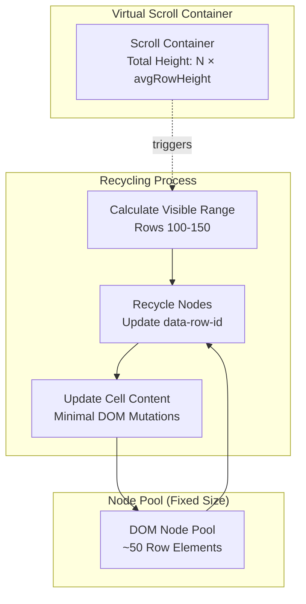

#### Node Recycling Implementation

```typescript
class DOMVirtualizer {
  private nodePool: HTMLElement[] = [];
  private activeNodes: Map<RowId, HTMLElement> = new Map();
  private rowHeightCache: Map<RowId, number> = new Map();

  constructor(
    private container: HTMLElement,
    private rowCount: number,
    private averageRowHeight: number = 40
  ) {
    this.initializePool();
  }

  private initializePool() {
    // Create initial pool based on viewport height
    const viewportHeight = this.container.clientHeight;
    const poolSize = Math.ceil(viewportHeight / this.averageRowHeight) + 10; // +10 overscan

    for (let i = 0; i < poolSize; i++) {
      const rowElement = this.createRowElement();
      this.nodePool.push(rowElement);
    }
  }

  render(visibleRowIds: RowId[], startIndex: number) {
    // Step 1: Return unused nodes to pool
    const visibleSet = new Set(visibleRowIds);
    for (const [rowId, node] of this.activeNodes) {
      if (!visibleSet.has(rowId)) {
        this.nodePool.push(node);
        this.activeNodes.delete(rowId);
      }
    }

    // Step 2: Render visible rows
    let offsetTop = this.calculateOffsetTop(startIndex);

    for (const rowId of visibleRowIds) {
      let rowElement = this.activeNodes.get(rowId);

      // Get node from pool if needed
      if (!rowElement) {
        rowElement = this.nodePool.pop() ?? this.createRowElement();
        this.activeNodes.set(rowId, rowElement);
      }

      // Update node position and content (CRITICAL: minimal DOM mutations)
      this.updateRowElement(rowElement, rowId, offsetTop);

      const rowHeight = this.rowHeightCache.get(rowId) ?? this.averageRowHeight;
      offsetTop += rowHeight;
    }
  }

  private updateRowElement(element: HTMLElement, rowId: RowId, offsetTop: number) {
    // Use transform for position (GPU-accelerated, no layout reflow)
    element.style.transform = `translateY(${offsetTop}px)`;

    // Update data attribute for accessibility
    element.setAttribute('data-row-id', rowId);

    // Update cell content via Lit directive (efficient)
    const rowData = this.getRowData(rowId);
    render(this.renderCells(rowData), element);
  }

  // Measure actual row height after render
  private measureRowHeight(element: HTMLElement, rowId: RowId) {
    const height = element.getBoundingClientRect().height;
    this.rowHeightCache.set(rowId, height);
    return height;
  }
}
```

### Canvas High-Performance Rendering Mode

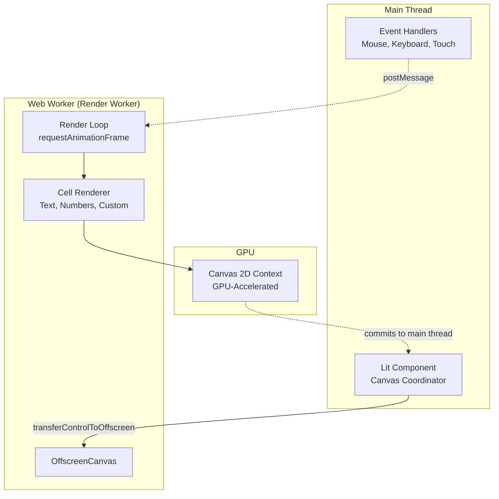

#### Canvas Rendering Implementation

```typescript
// Main thread: Canvas coordinator
class CanvasGridRenderer {
  private worker: Worker;
  private canvas: HTMLCanvasElement;
  private offscreenCanvas: OffscreenCanvas;

  constructor(canvas: HTMLCanvasElement, gridState: GridState) {
    this.canvas = canvas;
    this.offscreenCanvas = canvas.transferControlToOffscreen();

    // Spawn render worker
    this.worker = new Worker(new URL('./canvas-worker.ts', import.meta.url), {
      type: 'module'
    });

    // Transfer canvas to worker
    this.worker.postMessage({
      type: 'init',
      canvas: this.offscreenCanvas,
      gridState
    }, [this.offscreenCanvas]);
  }

  updateViewport(scrollTop: number, scrollLeft: number) {
    this.worker.postMessage({
      type: 'scroll',
      scrollTop,
      scrollLeft
    });
  }

  updateData(rowData: RowData[]) {
    // Use SharedArrayBuffer for zero-copy transfer (if available)
    // Otherwise use Transferable ArrayBuffer
    this.worker.postMessage({
      type: 'data',
      rowData
    });
  }
}

// Worker thread: Canvas renderer
// File: canvas-worker.ts
let canvas: OffscreenCanvas;
let ctx: OffscreenCanvasRenderingContext2D;
let gridState: GridState;
let animationFrameId: number;

self.onmessage = (event) => {
  const { type, ...payload } = event.data;

  switch (type) {
    case 'init':
      canvas = payload.canvas;
      ctx = canvas.getContext('2d')!;
      gridState = payload.gridState;
      startRenderLoop();
      break;

    case 'scroll':
      gridState.viewportState.scrollTop = payload.scrollTop;
      gridState.viewportState.scrollLeft = payload.scrollLeft;
      break;

    case 'data':
      gridState.data = payload.rowData;
      break;
  }
};

function startRenderLoop() {
  function render() {
    ctx.clearRect(0, 0, canvas.width, canvas.height);

    // Calculate visible range
    const { visibleRowIds } = virtualizePipeline(
      gridState.sortState.sortedRowIds,
      gridState.viewportState,
      new Map(), // row height cache
      40 // average row height
    );

    // Render visible rows
    let offsetY = -gridState.viewportState.scrollTop;
    const offsetX = -gridState.viewportState.scrollLeft;

    for (const rowId of visibleRowIds) {
      renderRow(ctx, rowId, offsetX, offsetY);
      offsetY += 40; // row height
    }

    animationFrameId = requestAnimationFrame(render);
  }

  render();
}

function renderRow(
  ctx: OffscreenCanvasRenderingContext2D,
  rowId: RowId,
  offsetX: number,
  offsetY: number
) {
  const rowData = gridState.rowIdMap.get(rowId)!;
  let cellX = offsetX;

  for (const column of gridState.columns) {
    const cellValue = rowData[column.id];

    // Draw cell background
    ctx.fillStyle = '#ffffff';
    ctx.fillRect(cellX, offsetY, column.width, 40);

    // Draw cell border
    ctx.strokeStyle = '#e0e0e0';
    ctx.strokeRect(cellX, offsetY, column.width, 40);

    // Draw cell text
    ctx.fillStyle = '#000000';
    ctx.font = '14px Inter, sans-serif';
    ctx.textBaseline = 'middle';
    ctx.fillText(String(cellValue), cellX + 8, offsetY + 20);

    cellX += column.width;
  }
}
```

### Hybrid DOM + Canvas Mode

For maximum performance with accessibility, render:
- **Canvas layer**: Read-only cell content (data viewport)
- **DOM layer**: Interactive elements (headers, filters, checkboxes, editable cells)
- **Semantic shadow tree**: Full accessibility tree (parallel to canvas)

```typescript
class HybridRenderer {
  private domLayer: DOMVirtualizer;
  private canvasLayer: CanvasGridRenderer;
  private a11yTree: SemanticShadowTree;

  render(visibleRowIds: RowId[]) {
    // Canvas renders fast read-only view
    this.canvasLayer.updateViewport(this.scrollTop, this.scrollLeft);

    // DOM renders only interactive cells (editing, selection checkboxes)
    const interactiveCells = this.getInteractiveCells(visibleRowIds);
    this.domLayer.render(interactiveCells);

    // A11y tree maintains full semantic structure for screen readers
    this.a11yTree.update(visibleRowIds);
  }
}
```

---

## Data Flow Architecture

### Main Data Flow Path

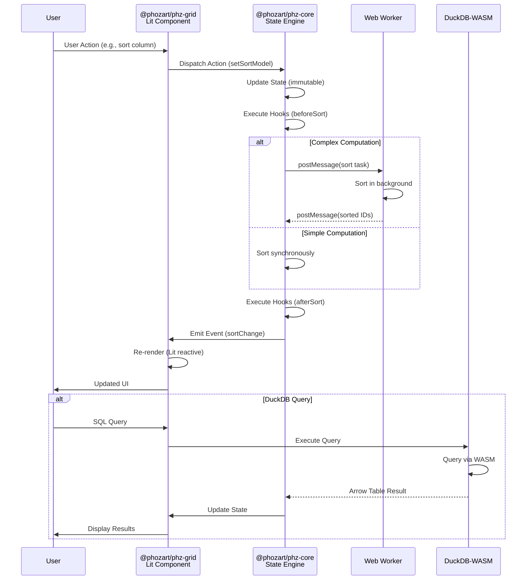

### Apache Arrow Zero-Copy Data Transfer

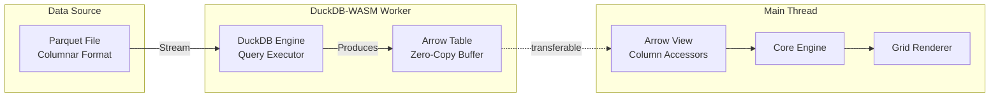

#### Arrow Integration Example

```typescript
import { tableFromIPC } from 'apache-arrow';

// Worker: DuckDB query returns Arrow buffer
async function executeQuery(sql: string): Promise<ArrayBuffer> {
  const conn = await db.connect();
  const result = await conn.query(sql);

  // Export as Arrow IPC (zero-copy)
  const arrowBuffer = await result.toArrowIPC();
  return arrowBuffer;
}

// Main thread: Consume Arrow table
async function loadQueryResult(arrowBuffer: ArrayBuffer) {
  // Parse Arrow table (zero-copy view over buffer)
  const table = tableFromIPC(arrowBuffer);

  // Convert to row data (lazy iterator, not full materialization)
  const rowData: RowData[] = [];
  for (const batch of table.batches) {
    for (let i = 0; i < batch.numRows; i++) {
      const row: RowData = { _id: `row-${i}` };

      for (const field of table.schema.fields) {
        const column = batch.getChild(field.name);
        row[field.name] = column?.get(i);
      }

      rowData.push(row);
    }
  }

  // Update grid state
  gridApi.setRowData(rowData);
}
```

### DuckDB-WASM Integration Path

```typescript
import * as duckdb from '@duckdb/duckdb-wasm';

class DuckDBDataSource {
  private db: duckdb.AsyncDuckDB;
  private worker: Worker;

  async initialize() {
    // Lazy-load DuckDB-WASM (3.5 MB)
    const JSDELIVR_BUNDLES = duckdb.getJsDelivrBundles();
    const bundle = await duckdb.selectBundle(JSDELIVR_BUNDLES);

    // Instantiate in Web Worker
    this.worker = new Worker(bundle.mainWorker!);
    const logger = new duckdb.ConsoleLogger();
    this.db = new duckdb.AsyncDuckDB(logger, this.worker);
    await this.db.instantiate(bundle.mainModule);
  }

  async loadParquet(url: string, tableName: string) {
    const conn = await this.db.connect();

    // Register Parquet file (streaming, doesn't load entire file)
    await conn.query(`
      CREATE OR REPLACE TABLE ${tableName} AS
      SELECT * FROM read_parquet('${url}')
    `);

    await conn.close();
  }

  async query(sql: string): Promise<RowData[]> {
    const conn = await this.db.connect();
    const result = await conn.query(sql);

    // Convert to row data
    const rowData = result.toArray().map((row, index) => ({
      _id: `row-${index}`,
      ...row
    }));

    await conn.close();
    return rowData;
  }

  async queryToArrow(sql: string): Promise<ArrayBuffer> {
    const conn = await this.db.connect();
    const result = await conn.query(sql);
    const arrowBuffer = await result.toArrowIPC();
    await conn.close();
    return arrowBuffer;
  }
}
```

---

## Accessibility Architecture

### Semantic Shadow DOM for Accessible Virtualization

This is the CORE DIFFERENTIATOR. No other grid has solved this.

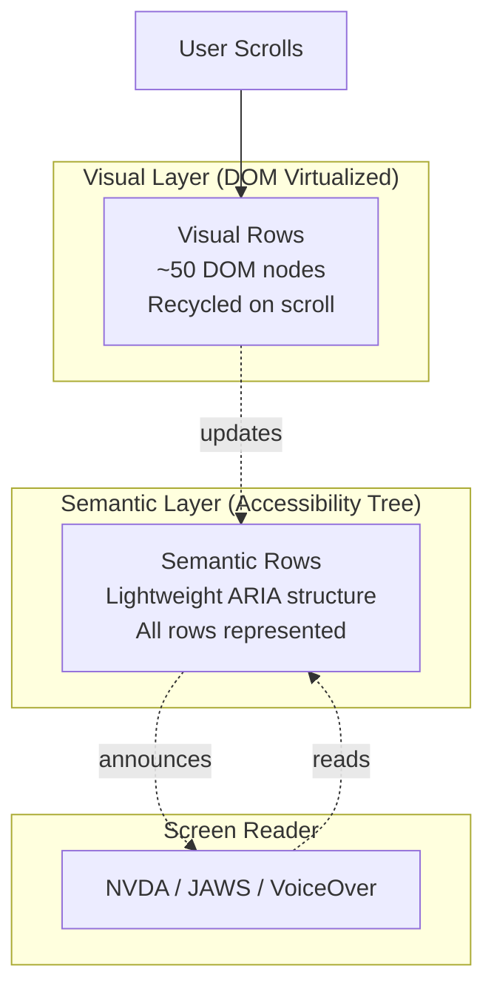

#### Semantic Shadow Structure Implementation

```typescript
class SemanticShadowTree {
  private shadowRoot: ShadowRoot;
  private semanticRows: Map<RowId, HTMLElement> = new Map();

  constructor(hostElement: HTMLElement) {
    // Create shadow root for a11y tree (separate from visual tree)
    this.shadowRoot = hostElement.attachShadow({ mode: 'open' });
    this.initializeA11yStructure();
  }

  private initializeA11yStructure() {
    const table = document.createElement('table');
    table.setAttribute('role', 'grid');
    table.setAttribute('aria-rowcount', String(this.totalRowCount));
    table.setAttribute('aria-colcount', String(this.totalColumnCount));

    const tbody = document.createElement('tbody');
    tbody.setAttribute('role', 'rowgroup');
    table.appendChild(tbody);

    this.shadowRoot.appendChild(table);
  }

  update(visibleRowIds: RowId[], totalRowCount: number) {
    const tbody = this.shadowRoot.querySelector('tbody')!;

    // Update aria-rowcount
    this.shadowRoot.querySelector('[role="grid"]')!
      .setAttribute('aria-rowcount', String(totalRowCount));

    // Create lightweight semantic rows for ALL rows (not just visible)
    // CRITICAL: These are minimal <div role="row"> with aria-rowindex, no content
    for (let i = 0; i < totalRowCount; i++) {
      const rowId = this.allRowIds[i];

      if (!this.semanticRows.has(rowId)) {
        const semanticRow = document.createElement('div');
        semanticRow.setAttribute('role', 'row');
        semanticRow.setAttribute('aria-rowindex', String(i + 1));
        semanticRow.setAttribute('aria-label', this.getRowLabel(rowId));

        // If row is visible, reference actual DOM content
        if (visibleRowIds.includes(rowId)) {
          const visualRow = this.getVisualRow(rowId);
          semanticRow.setAttribute('aria-describedby', visualRow.id);
        } else {
          // For non-visible rows, provide minimal semantic info
          semanticRow.textContent = `Row ${i + 1}: ${this.getRowSummary(rowId)}`;
        }

        tbody.appendChild(semanticRow);
        this.semanticRows.set(rowId, semanticRow);
      }
    }
  }

  private getRowLabel(rowId: RowId): string {
    const rowData = this.gridState.rowIdMap.get(rowId)!;
    const firstColumn = this.gridState.columns[0];
    return `Row: ${rowData[firstColumn.id]}`;
  }

  private getRowSummary(rowId: RowId): string {
    const rowData = this.gridState.rowIdMap.get(rowId)!;
    return Object.values(rowData).slice(0, 3).join(', ');
  }

  announceScrollPosition(currentRowIndex: number, totalRows: number) {
    // Use ARIA live region for scroll announcements
    const liveRegion = this.shadowRoot.querySelector('[role="status"]')!;
    liveRegion.textContent = `Row ${currentRowIndex} of ${totalRows}`;
  }
}
```

### Keyboard Navigation (Composite Widget Pattern)

Implements ARIA composite widget with roving tabindex, reducing tab stops from 1000 to 5.

```typescript
class KeyboardNavigationManager {
  private focusedCellId: CellId | null = null;
  private tabStops: HTMLElement[] = [];

  constructor(private gridElement: HTMLElement) {
    this.initializeTabStops();
    this.attachKeyboardListeners();
  }

  private initializeTabStops() {
    // CRITICAL: Grid has exactly 5 tab stops
    this.tabStops = [
      this.gridElement.querySelector('.filter-row')!,       // 1. Filter inputs
      this.gridElement.querySelector('.column-headers')!,   // 2. Column headers
      this.gridElement.querySelector('.grid-body')!,        // 3. Data grid (roving tabindex)
      this.gridElement.querySelector('.pagination')!,       // 4. Pagination controls
      this.gridElement.querySelector('.grid-settings')!     // 5. Grid settings menu
    ];

    // Set tabindex
    this.tabStops.forEach((el, i) => {
      el.setAttribute('tabindex', '0');
    });
  }

  private attachKeyboardListeners() {
    const gridBody = this.tabStops[2]; // Grid body

    gridBody.addEventListener('keydown', (event) => {
      switch (event.key) {
        case 'ArrowRight':
          this.moveFocusRight();
          event.preventDefault();
          break;
        case 'ArrowLeft':
          this.moveFocusLeft();
          event.preventDefault();
          break;
        case 'ArrowDown':
          this.moveFocusDown();
          event.preventDefault();
          break;
        case 'ArrowUp':
          this.moveFocusUp();
          event.preventDefault();
          break;
        case 'Home':
          if (event.ctrlKey) {
            this.moveFocusToFirstCell();
          } else {
            this.moveFocusToRowStart();
          }
          event.preventDefault();
          break;
        case 'End':
          if (event.ctrlKey) {
            this.moveFocusToLastCell();
          } else {
            this.moveFocusToRowEnd();
          }
          event.preventDefault();
          break;
        case 'Enter':
          this.activateCell();
          event.preventDefault();
          break;
        case 'F2':
          this.enterEditMode();
          event.preventDefault();
          break;
        case 'Escape':
          this.exitEditMode();
          event.preventDefault();
          break;
        case ' ':
          if (event.ctrlKey) {
            this.toggleRowSelection();
          }
          event.preventDefault();
          break;
      }
    });
  }

  private moveFocusRight() {
    const [rowId, columnId] = this.parseCellId(this.focusedCellId);
    const nextColumnIndex = this.gridState.columnOrder.indexOf(columnId) + 1;

    if (nextColumnIndex < this.gridState.columnOrder.length) {
      const nextColumnId = this.gridState.columnOrder[nextColumnIndex];
      this.setFocusedCell(this.makeCellId(rowId, nextColumnId));
    }
  }

  private setFocusedCell(cellId: CellId) {
    // Remove tabindex from previous cell
    if (this.focusedCellId) {
      const prevCell = this.getCellElement(this.focusedCellId);
      prevCell?.setAttribute('tabindex', '-1');
    }

    // Set tabindex on new cell (roving tabindex pattern)
    const newCell = this.getCellElement(cellId);
    newCell?.setAttribute('tabindex', '0');
    newCell?.focus();

    this.focusedCellId = cellId;

    // Announce to screen reader
    this.announceCellFocus(cellId);
  }

  private announceCellFocus(cellId: CellId) {
    const [rowId, columnId] = this.parseCellId(cellId);
    const rowIndex = this.gridState.sortedRowIds.indexOf(rowId);
    const columnIndex = this.gridState.columnOrder.indexOf(columnId);
    const column = this.gridState.columns.find(c => c.id === columnId);
    const cellValue = this.gridState.rowIdMap.get(rowId)?.[columnId];

    const announcement = `Row ${rowIndex + 1} of ${this.gridState.sortedRowIds.length}, ` +
                         `Column ${columnIndex + 1} of ${this.gridState.columns.length}: ` +
                         `${column?.name}, ${cellValue}`;

    this.liveRegion.textContent = announcement;
  }
}
```

### Forced Colors Mode Support

```css
/* Layer 4: Forced Colors Mode overrides */
@media (forced-colors: active) {
  .phz-grid {
    /* Use system colors */
    background-color: Canvas;
    color: CanvasText;
    border-color: CanvasText;
  }

  .phz-cell {
    border: 1px solid CanvasText;
  }

  .phz-cell--selected {
    background-color: Highlight;
    color: HighlightText;
    border: 2px solid HighlightText;
  }

  .phz-cell--focused {
    outline: 2px solid CanvasText;
    outline-offset: -2px;
  }

  .phz-header {
    background-color: ButtonFace;
    color: ButtonText;
    border-bottom: 2px solid CanvasText;
  }

  /* Remove background images (not visible in forced colors) */
  .phz-sort-indicator {
    background-image: none;
    /* Use text-based indicator instead */
  }

  .phz-sort-indicator::after {
    content: attr(data-sort-direction);
  }
}
```

---

## Collaboration Architecture

### Yjs CRDT Document Structure

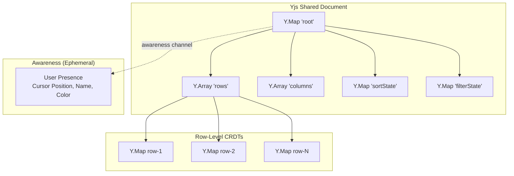

#### Yjs Binding Implementation

```typescript
import * as Y from 'yjs';
import { WebsocketProvider } from 'y-websocket';

class CollabGridBinding {
  private yDoc: Y.Doc;
  private yRows: Y.Array<Y.Map<any>>;
  private yColumns: Y.Array<any>;
  private awareness: WebsocketProvider['awareness'];

  constructor(
    private gridApi: GridApi,
    private roomId: string,
    private userId: string
  ) {
    this.yDoc = new Y.Doc();
    this.initializeYjsStructure();
    this.bindToGrid();
    this.connectToSyncBackend();
  }

  private initializeYjsStructure() {
    const root = this.yDoc.getMap('root');

    // Initialize CRDT structures
    this.yRows = root.get('rows') ?? new Y.Array();
    this.yColumns = root.get('columns') ?? new Y.Array();
    root.set('rows', this.yRows);
    root.set('columns', this.yColumns);

    // Initialize from current grid state
    const currentState = this.gridApi.getState();

    for (const row of currentState.data) {
      const yRow = new Y.Map();
      Object.entries(row).forEach(([key, value]) => {
        yRow.set(key, value);
      });
      this.yRows.push([yRow]);
    }
  }

  private bindToGrid() {
    // Yjs → Grid (remote updates)
    this.yRows.observe((event) => {
      event.changes.added.forEach((item) => {
        const yRow = item.content.type as Y.Map<any>;
        const rowData = yRow.toJSON();
        this.gridApi.addRow(rowData);
      });

      event.changes.deleted.forEach((item) => {
        // Handle row deletion
      });
    });

    // Grid → Yjs (local updates)
    this.gridApi.on('cellEditCommit', ({ rowId, columnId, newValue }) => {
      const rowIndex = this.findRowIndex(rowId);
      const yRow = this.yRows.get(rowIndex);

      // Yjs handles conflict resolution automatically
      yRow.set(columnId, newValue);
    });
  }

  private connectToSyncBackend() {
    // WebSocket provider (can swap for WebRTC, IndexedDB, etc.)
    const provider = new WebsocketProvider(
      'wss://sync.phozart.io',
      this.roomId,
      this.yDoc
    );

    this.awareness = provider.awareness;

    // Set local user state
    this.awareness.setLocalState({
      user: {
        id: this.userId,
        name: this.getUserName(),
        color: this.getUserColor()
      },
      cursor: null
    });

    // Listen for presence updates
    this.awareness.on('change', () => {
      this.updatePresenceCursors();
    });
  }

  private updatePresenceCursors() {
    const states = this.awareness.getStates();
    const cursors: PresenceCursor[] = [];

    states.forEach((state, clientId) => {
      if (clientId === this.yDoc.clientID) return; // Skip self

      if (state.cursor) {
        cursors.push({
          userId: state.user.id,
          userName: state.user.name,
          color: state.user.color,
          cellId: state.cursor.cellId
        });
      }
    });

    // Render presence cursors
    this.gridApi.setPresenceCursors(cursors);
  }

  // Announce cursor position
  announceCursorPosition(cellId: CellId) {
    const currentState = this.awareness.getLocalState();
    this.awareness.setLocalState({
      ...currentState,
      cursor: { cellId, timestamp: Date.now() }
    });
  }
}
```

### Conflict Resolution Strategy

Yjs CRDTs provide automatic conflict resolution:

1. **Cell-level edits**: Last-write-wins (LWW) based on Lamport timestamp
2. **Structural changes** (add/delete rows): Operation-based CRDT ensures convergence
3. **Concurrent edits to same cell**: Both edits preserved in history, latest timestamp wins for display

```typescript
// Example: Two users edit same cell concurrently
// User A (LA time): Sets cell A1 = "Alice" at 10:00:00.000
// User B (NYC time): Sets cell A1 = "Bob" at 10:00:00.100

// Yjs resolution:
// - Both operations are applied to CRDT
// - Final value: "Bob" (later timestamp)
// - History preserved: ["Alice" @ 10:00:00.000, "Bob" @ 10:00:00.100]
// - No data loss, deterministic convergence
```

---

## AI Architecture

### Schema-as-Contract Pattern

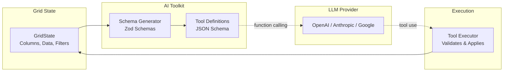

#### Schema Generation Implementation

```typescript
import { z } from 'zod';

class AISchemaGenerator {
  generateGridSchema(gridState: GridState): z.ZodObject<any> {
    const columnSchemas: Record<string, z.ZodType<any>> = {};

    for (const column of gridState.columns) {
      switch (column.type) {
        case 'string':
          columnSchemas[column.id] = z.string();
          break;
        case 'number':
          columnSchemas[column.id] = z.number();
          break;
        case 'boolean':
          columnSchemas[column.id] = z.boolean();
          break;
        case 'date':
          columnSchemas[column.id] = z.date();
          break;
        default:
          columnSchemas[column.id] = z.any();
      }
    }

    return z.object({
      _id: z.string(),
      ...columnSchemas
    });
  }

  generateToolDefinitions(gridState: GridState): ToolDefinition[] {
    const rowSchema = this.generateGridSchema(gridState);

    return [
      {
        name: 'filter_rows',
        description: 'Filter grid rows by column values',
        parameters: {
          type: 'object',
          properties: {
            columnId: { type: 'string', enum: gridState.columns.map(c => c.id) },
            operator: { type: 'string', enum: ['equals', 'contains', 'greaterThan', 'lessThan'] },
            value: { type: 'string' }
          },
          required: ['columnId', 'operator', 'value']
        }
      },
      {
        name: 'sort_rows',
        description: 'Sort grid rows by column',
        parameters: {
          type: 'object',
          properties: {
            columnId: { type: 'string', enum: gridState.columns.map(c => c.id) },
            direction: { type: 'string', enum: ['asc', 'desc'] }
          },
          required: ['columnId', 'direction']
        }
      },
      {
        name: 'aggregate_column',
        description: 'Calculate aggregate (sum, avg, min, max, count) for a column',
        parameters: {
          type: 'object',
          properties: {
            columnId: { type: 'string', enum: gridState.columns.map(c => c.id) },
            operation: { type: 'string', enum: ['sum', 'avg', 'min', 'max', 'count'] }
          },
          required: ['columnId', 'operation']
        }
      },
      {
        name: 'update_cell',
        description: 'Update a specific cell value',
        parameters: {
          type: 'object',
          properties: {
            rowId: { type: 'string' },
            columnId: { type: 'string', enum: gridState.columns.map(c => c.id) },
            value: { type: 'any' }
          },
          required: ['rowId', 'columnId', 'value']
        }
      }
    ];
  }
}

// Natural Language Query Processor
class NLQueryProcessor {
  constructor(
    private gridApi: GridApi,
    private llmAdapter: LLMAdapter
  ) {}

  async processQuery(userQuery: string): Promise<QueryResult> {
    const gridState = this.gridApi.getState();
    const tools = new AISchemaGenerator().generateToolDefinitions(gridState);

    // Send to LLM with tool definitions
    const response = await this.llmAdapter.chat({
      messages: [
        {
          role: 'system',
          content: 'You are a data grid assistant. Use the provided tools to answer user queries about the grid data.'
        },
        {
          role: 'user',
          content: userQuery
        }
      ],
      tools
    });

    // Execute tool calls
    const results: any[] = [];
    for (const toolCall of response.toolCalls) {
      const result = await this.executeToolCall(toolCall);
      results.push(result);
    }

    return {
      naturalLanguageResponse: response.message,
      toolResults: results
    };
  }

  private async executeToolCall(toolCall: ToolCall): Promise<any> {
    switch (toolCall.name) {
      case 'filter_rows':
        return this.gridApi.setColumnFilter(
          toolCall.arguments.columnId,
          {
            operator: toolCall.arguments.operator,
            value: toolCall.arguments.value
          }
        );

      case 'sort_rows':
        return this.gridApi.setSortModel([{
          columnId: toolCall.arguments.columnId,
          direction: toolCall.arguments.direction
        }]);

      case 'aggregate_column':
        return this.gridApi.aggregateColumn(
          toolCall.arguments.columnId,
          toolCall.arguments.operation
        );

      case 'update_cell':
        return this.gridApi.updateCell(
          toolCall.arguments.rowId,
          toolCall.arguments.columnId,
          toolCall.arguments.value
        );

      default:
        throw new Error(`Unknown tool: ${toolCall.name}`);
    }
  }
}

// Usage example
const nlProcessor = new NLQueryProcessor(gridApi, new OpenAIAdapter(apiKey));

// User types: "Show me all customers in California"
const result = await nlProcessor.processQuery("Show me all customers in California");
// AI generates: filter_rows({ columnId: 'state', operator: 'equals', value: 'CA' })
// Grid applies filter automatically
```

---

## Extensibility Architecture

### Three-Model Extensibility System

phz-grid combines the best of three extensibility patterns:

1. **Hooks** (Handsontable-style): Before/after middleware for pipeline stages
2. **Slots** (AG Grid-style): Named Web Component slots for UI injection
3. **Headless Core** (TanStack-style): Full control over rendering

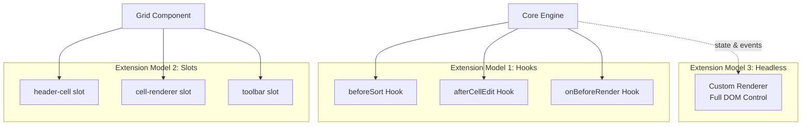

#### Hook System Usage

```typescript
// Plugin using hooks
class AuditLogPlugin {
  constructor(private gridApi: GridApi) {
    this.gridApi.registerHook('afterCellEdit', this.logEdit.bind(this));
  }

  private logEdit(context: AfterCellEditContext) {
    fetch('/api/audit-log', {
      method: 'POST',
      body: JSON.stringify({
        userId: getCurrentUser(),
        timestamp: Date.now(),
        action: 'cell_edit',
        rowId: context.rowId,
        columnId: context.columnId,
        oldValue: context.oldValue,
        newValue: context.newValue
      })
    });
  }
}
```

#### Slot System Usage

```html
<!-- Custom cell renderer via slot -->
<phz-grid>
  <template slot="cell-renderer-status">
    <div class="status-badge" data-status="${value}">
      ${value === 'active' ? '🟢' : '🔴'} ${value}
    </div>
  </template>

  <template slot="header-actions">
    <button @click="${exportToExcel}">Export</button>
    <button @click="${openSettings}">Settings</button>
  </template>
</phz-grid>
```

#### Headless Usage (TanStack-style)

```typescript
import { createGrid } from '@phozart/phz-core';
import { useGridState } from '@phozart/phz-react';

function CustomGrid() {
  const grid = useGridState(createGrid({ data, columns }));

  return (
    <div className="my-custom-grid">
      <header>
        {grid.columns.map(col => (
          <div key={col.id} onClick={() => grid.api.sortByColumn(col.id)}>
            {col.name} {grid.sortState[col.id]?.direction}
          </div>
        ))}
      </header>

      <main>
        {grid.visibleRows.map(row => (
          <div key={row._id} className="custom-row">
            {grid.columns.map(col => (
              <span key={col.id}>{row[col.id]}</span>
            ))}
          </div>
        ))}
      </main>
    </div>
  );
}
```

### Plugin Lifecycle

```typescript
interface Plugin {
  name: string;
  version: string;

  // Lifecycle
  onInstall?(gridApi: GridApi): void;
  onUninstall?(gridApi: GridApi): void;

  // Hooks (optional)
  hooks?: Partial<HookRegistry>;

  // Custom columns (optional)
  columns?: CustomColumnDef[];

  // Custom editors (optional)
  editors?: Record<string, CellEditorComponent>;

  // Custom filters (optional)
  filters?: Record<string, FilterComponent>;
}

// Plugin registration
gridApi.registerPlugin({
  name: 'row-numbering',
  version: '1.0.0',

  onInstall(gridApi) {
    gridApi.addColumn({
      id: '_row_number',
      name: '#',
      width: 60,
      pinned: 'left',
      cellRenderer: (row, index) => String(index + 1)
    });
  },

  onUninstall(gridApi) {
    gridApi.removeColumn('_row_number');
  }
});
```

---

## Performance Architecture

### Web Worker Strategy

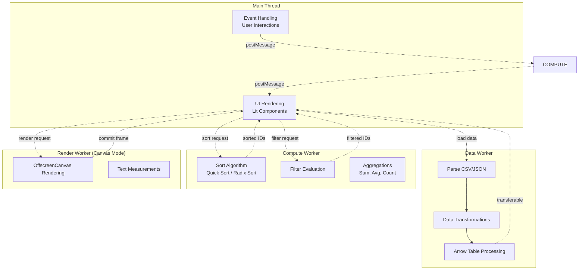

### Performance Budgets

| Metric | Target | Measurement |
|--------|--------|-------------|
| Core bundle size | <50 KB gzipped | `bundlephobia.com` + CI size check |
| Total bundle (with Lit) | <70 KB gzipped | Full `@phozart/phz-grid` package |
| Memory at 100K rows | <500 MB | Chrome DevTools Memory Profiler |
| Memory at 1M rows | <2 GB | With DuckDB-WASM + virtualization |
| Initial render (10K rows) | <500 ms | Lighthouse, Web Vitals |
| Sort 100K rows | <200 ms | Performance.now() benchmark |
| Filter 100K rows | <100 ms | Performance.now() benchmark |
| Scroll frame rate | 60 fps | Chrome DevTools Performance |
| First Contentful Paint | <1 sec | Lighthouse |
| Time to Interactive | <3 sec | Lighthouse |

### RequestAnimationFrame Batching

```typescript
class RenderScheduler {
  private pendingUpdates: Set<UpdateTask> = new Set();
  private rafId: number | null = null;

  scheduleUpdate(task: UpdateTask) {
    this.pendingUpdates.add(task);

    if (!this.rafId) {
      this.rafId = requestAnimationFrame(() => this.flush());
    }
  }

  private flush() {
    // Batch all pending updates into single render
    const updates = Array.from(this.pendingUpdates);
    this.pendingUpdates.clear();
    this.rafId = null;

    // Group updates by type to minimize layout thrashing
    const layoutUpdates = updates.filter(u => u.type === 'layout');
    const paintUpdates = updates.filter(u => u.type === 'paint');

    // Apply layout updates (read-then-write pattern)
    const measurements = layoutUpdates.map(u => u.measure());
    layoutUpdates.forEach((u, i) => u.apply(measurements[i]));

    // Apply paint updates
    paintUpdates.forEach(u => u.apply());
  }
}
```

### Passive Event Listeners

```typescript
// CRITICAL: Use passive listeners for scroll to avoid blocking compositor
element.addEventListener('scroll', handleScroll, { passive: true });

function handleScroll(event: Event) {
  // Cannot call preventDefault() in passive listener
  // Good: This allows browser to scroll immediately without waiting for JS

  const scrollTop = (event.target as HTMLElement).scrollTop;
  scheduler.scheduleUpdate({
    type: 'scroll',
    scrollTop
  });
}
```

### WASM SIMD Optimization (Future)

```wat
;; Example: Vectorized filter operation using WASM SIMD
(module
  (func $filter_greater_than (param $data i32) (param $length i32) (param $threshold i32) (result i32)
    (local $i i32)
    (local $result i32)
    (local $vec_threshold v128)

    ;; Broadcast threshold to all lanes
    (local.set $vec_threshold (i32x4.splat (local.get $threshold)))

    ;; Process 4 elements at a time
    (block $break
      (loop $loop
        ;; Load 4 integers
        (local.get $data)
        (v128.load)

        ;; Compare with threshold (SIMD)
        (local.get $vec_threshold)
        (i32x4.gt_s)

        ;; Store result
        ;; ... (result processing)

        (local.set $i (i32.add (local.get $i) (i32.const 4)))
        (br_if $loop (i32.lt_u (local.get $i) (local.get $length)))
      )
    )

    (local.get $result)
  )
)
```

---

## Technology Stack

### Core Technologies

| Layer | Technology | Version | Justification |
|-------|-----------|---------|---------------|
| **Language** | TypeScript | 5.x | Type safety, IDE support, industry standard |
| **Component Model** | Web Components | Native | Framework-agnostic, future-proof |
| **Rendering Library** | Lit | 5.x | Smallest WC library (~7 KB), signals-based reactivity |
| **Build Tool** | Vite | 6.x | Fast dev server, optimized production builds, ESM-native |
| **Test Runner** | Vitest | 3.x | Fast, Vite-native, Jest-compatible API |
| **E2E Testing** | Playwright | 1.x | Cross-browser, accessibility testing, mobile emulation |
| **Package Manager** | npm | 10.x | Ubiquitous, workspaces support |
| **Monorepo Tool** | Native npm workspaces | N/A | No additional tooling needed |

### Advanced Technologies

| Feature | Technology | Version | Size | Justification |
|---------|-----------|---------|------|---------------|
| **SQL Engine** | DuckDB-WASM | 1.31.x | 3.5 MB | 10-100x faster than JS alternatives, production-ready |
| **Data Format** | Apache Arrow | 18.x | ~200 KB | Zero-copy columnar data, industry standard |
| **CRDTs** | Yjs | 13.x | ~50 KB | 900K+ weekly downloads, battle-tested |
| **CRDT Sync** | y-websocket | 2.x | ~10 KB | Reference WebSocket provider |
| **Schema Validation** | Zod | 3.x | ~30 KB | TypeScript-first, best DX |

### Browser APIs Leveraged

| API | Purpose | Availability | Fallback |
|-----|---------|--------------|----------|
| **Web Workers** | Background computation | All browsers | Synchronous fallback |
| **OffscreenCanvas** | Non-blocking canvas rendering | Chrome 69+, Firefox 105+ | Main thread canvas |
| **SharedArrayBuffer** | Zero-copy worker data transfer | Chrome 68+, Firefox 79+ | Transferable ArrayBuffer |
| **Container Queries** | Responsive layout | Baseline 2023 | Media queries |
| **View Transitions API** | Smooth state changes | Chrome 111+ | Instant transitions |
| **Popover API** | Filter dropdowns | Chrome 114+ | Manual positioning |
| **Declarative Shadow DOM** | SSR support | Chrome 90+, Safari 16.4+ | Client-side attachment |
| **CSS `forced-colors`** | High contrast mode | All modern browsers | N/A (graceful degradation) |

### Dependencies Philosophy

1. **Zero dependencies for core** — `@phozart/phz-core` has ZERO npm dependencies
2. **Minimal dependencies for grid** — Only Lit (~7 KB)
3. **Advanced features are lazy-loaded** — DuckDB, Yjs loaded on-demand
4. **Peer dependencies for frameworks** — React, Vue, Angular are peer deps
5. **Tree-shakable** — All packages export ESM with sideEffects: false

---

## Deployment Architecture

### Package Distribution

```mermaid
graph TB
    subgraph "npm Registry"
        NPM_CORE[@phozart/phz-core]
        NPM_GRID[@phozart/phz-grid]
        NPM_REACT[@phozart/phz-react]
        NPM_ADVANCED[Advanced Packages]
    end

    subgraph "CDN (jsDelivr)"
        CDN_ESM[ESM Bundles<br/>phz-grid.esm.js]
        CDN_UMD[UMD Bundles<br/>phz-grid.umd.js]
    end

    subgraph "Developer Build Process"
        VITE[Vite Build]
        WEBPACK[Webpack Build]
        ROLLUP[Rollup Build]
    end

    NPM_CORE --> VITE
    NPM_GRID --> VITE
    NPM_REACT --> VITE
    NPM_ENTERPRISE --> VITE

    NPM_CORE --> WEBPACK
    NPM_CORE --> ROLLUP

    NPM_CORE -.mirrors to.-> CDN_ESM
    NPM_GRID -.mirrors to.-> CDN_UMD
```

### SSR Support Matrix

| Framework | SSR Support | Implementation |
|-----------|-------------|----------------|
| **Next.js** (React) | Full | Declarative Shadow DOM, no `window` access in `@phozart/phz-core` |
| **Nuxt** (Vue) | Full | Same as Next.js |
| **Angular Universal** | Full | Same as Next.js |
| **SvelteKit** | Full | Web Components work universally |
| **Astro** | Full | Island architecture compatible |

#### SSR Example (Next.js)

```tsx
// app/grid-page.tsx (Next.js 14)
import { PhzGrid } from '@phozart/phz-react';

export default async function GridPage() {
  const data = await fetchData();

  return (
    <PhzGrid
      data={data}
      columns={columns}
      // Renders with Declarative Shadow DOM on server
      // Hydrates on client without re-render
    />
  );
}
```

### Edge Deployment

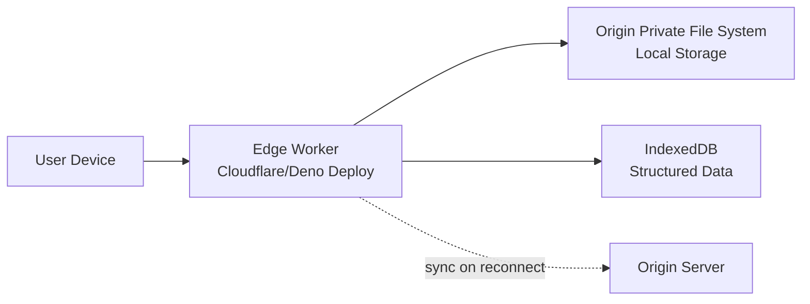

### Build Outputs

```
dist/
├── esm/                    # ES modules (tree-shakable)
│   ├── index.js
│   ├── core.js
│   └── virtualization.js
├── cjs/                    # CommonJS (legacy support - NONE, ESM-only)
├── types/                  # TypeScript declarations
│   ├── index.d.ts
│   └── core.d.ts
├── phz-grid.esm.js     # Bundled ESM for CDN
├── phz-grid.umd.js     # UMD for legacy <script> tags
└── phz-grid.css        # Extracted CSS
```

---

## Security Architecture

### Threat Model

| Threat | Mitigation |
|--------|------------|
| **XSS via cell content** | All cell rendering uses Lit's `html` tagged template (auto-escapes) |
| **CSV injection** | Sanitize formulas on export (prefix `=`, `+`, `-`, `@` with `'`) |
| **CORS leaks (DuckDB)** | DuckDB-WASM runs in same-origin worker, no CORS bypass |
| **Collaboration MITM** | Require TLS for WebSocket sync, validate Yjs signatures |
| **Data exfiltration via plugins** | Plugin sandboxing, CSP headers required |
| **Denial of Service (large data)** | Memory limits, worker termination, incremental parsing |

### Content Security Policy

```html
<meta http-equiv="Content-Security-Policy" content="
  default-src 'self';
  script-src 'self' 'wasm-unsafe-eval';
  worker-src 'self' blob:;
  connect-src 'self' wss://sync.phozart.io;
  style-src 'self' 'unsafe-inline';
">
```

**Justification for `unsafe-inline` styles**: Lit uses Shadow DOM with adoptedStyleSheets, but fallback requires inline styles for older browsers.

### Authentication & Authorization

phz-grid is a **client-side library** and does NOT handle authentication. Integration pattern:

```typescript
// Application code provides auth
const gridApi = createGrid({
  data: [], // Initially empty
  onBeforeDataFetch: async () => {
    const token = await getAuthToken();
    return { headers: { Authorization: `Bearer ${token}` } };
  }
});

// Collaboration auth
const collabBinding = new CollabGridBinding(gridApi, roomId, {
  auth: {
    token: await getAuthToken(),
    userId: getCurrentUser().id
  }
});
```

### Data Privacy (GDPR/CCPA)

1. **Data Residency**: All data processing happens client-side (no server round-trips except collaboration sync)
2. **Right to Erasure**: `gridApi.deleteRows(rowIds)` permanently removes data from CRDT
3. **Data Export**: `gridApi.exportState()` provides full data export in JSON
4. **Audit Logging**: `afterCellEdit` hook enables audit trail

---

## Cross-Cutting Concerns

### Logging & Monitoring

```typescript
class GridLogger {
  private context: LogContext;

  constructor(gridId: string) {
    this.context = { gridId, version: GRID_VERSION };
  }

  info(message: string, meta?: any) {
    console.info('[phz-grid]', message, { ...this.context, ...meta });
  }

  warn(message: string, meta?: any) {
    console.warn('[phz-grid]', message, { ...this.context, ...meta });

    // Optional: Send to monitoring service
    if (window.analytics) {
      window.analytics.track('grid_warning', { message, ...this.context, ...meta });
    }
  }

  error(error: Error, meta?: any) {
    console.error('[phz-grid]', error, { ...this.context, ...meta });

    // Optional: Send to error tracking
    if (window.Sentry) {
      window.Sentry.captureException(error, { contexts: { grid: { ...this.context, ...meta } } });
    }
  }

  performance(metric: string, duration: number) {
    console.debug(`[phz-grid] ${metric}: ${duration}ms`);

    // Optional: Send to performance monitoring
    if (window.performance && window.performance.measure) {
      performance.measure(metric);
    }
  }
}
```

### Internationalization (i18n)

```typescript
interface GridTranslations {
  // Pagination
  'pagination.first': string;
  'pagination.previous': string;
  'pagination.next': string;
  'pagination.last': string;
  'pagination.rowsPerPage': string;

  // Filtering
  'filter.contains': string;
  'filter.equals': string;
  'filter.startsWith': string;
  'filter.endsWith': string;
  'filter.clear': string;

  // Sorting
  'sort.ascending': string;
  'sort.descending': string;
  'sort.none': string;

  // Accessibility
  'a11y.rowCountAnnouncement': (current: number, total: number) => string;
  'a11y.columnCountAnnouncement': (current: number, total: number) => string;
  'a11y.cellAnnouncement': (row: number, col: number, value: any) => string;
}

// Load translations
gridApi.setTranslations({
  locale: 'fr-FR',
  translations: frenchTranslations
});
```

### Error Handling

```typescript
class GridErrorBoundary {
  constructor(private gridApi: GridApi) {
    this.attachErrorHandlers();
  }

  private attachErrorHandlers() {
    // Catch errors in hooks
    this.gridApi.on('hookError', ({ hook, error }) => {
      this.handleError(new GridError(`Hook "${hook}" failed`, { cause: error }));
    });

    // Catch errors in cell renderers
    this.gridApi.on('renderError', ({ cellId, error }) => {
      this.handleError(new GridError(`Cell render failed: ${cellId}`, { cause: error }));
      // Fallback: Render error state in cell
      this.renderErrorCell(cellId);
    });

    // Catch errors in data processing
    this.gridApi.on('dataError', ({ stage, error }) => {
      this.handleError(new GridError(`Data processing failed at ${stage}`, { cause: error }));
    });
  }

  private handleError(error: GridError) {
    // Log error
    this.gridApi.logger.error(error);

    // Emit error event for application handling
    this.gridApi.emit('error', { error });

    // Optional: Show user-facing error message
    if (this.gridApi.config.showErrorMessages) {
      this.showErrorToast(error.message);
    }
  }

  private renderErrorCell(cellId: CellId) {
    // Render fallback UI for failed cell
    const cell = this.getCellElement(cellId);
    if (cell) {
      cell.innerHTML = '<span class="cell-error" title="Render error">⚠️</span>';
    }
  }
}
```

### Theming System (Three-Layer CSS)

```css
/* Layer 1: Primitive Tokens (Brand) */
:root {
  --phz-color-primary-50: #eff6ff;
  --phz-color-primary-500: #3b82f6;
  --phz-color-primary-900: #1e3a8a;

  --phz-spacing-1: 4px;
  --phz-spacing-2: 8px;
  --phz-spacing-4: 16px;

  --phz-font-family: 'Inter', sans-serif;
  --phz-font-size-sm: 12px;
  --phz-font-size-base: 14px;
}

/* Layer 2: Semantic Tokens (Theme) */
:root {
  --phz-grid-bg: var(--phz-color-primary-50);
  --phz-grid-border: var(--phz-color-primary-500);
  --phz-grid-text: var(--phz-color-primary-900);

  --phz-cell-padding: var(--phz-spacing-2) var(--phz-spacing-4);
  --phz-cell-font: var(--phz-font-size-base) var(--phz-font-family);
}

/* Layer 3: Component Tokens */
.phz-grid {
  background: var(--phz-grid-bg);
  border: 1px solid var(--phz-grid-border);
  color: var(--phz-grid-text);
}

.phz-cell {
  padding: var(--phz-cell-padding);
  font: var(--phz-cell-font);
}

/* Dark mode override (Layer 2) */
@media (prefers-color-scheme: dark) {
  :root {
    --phz-grid-bg: #1e293b;
    --phz-grid-border: #475569;
    --phz-grid-text: #f1f5f9;
  }
}
```

---

## Shared Infrastructure Package (`@phozart/phz-shared`)

Added in v15. `@phozart/phz-shared` is the extracted foundation layer that all shells and higher-level packages depend on. It contains zero Lit or DOM dependencies and exports only pure functions, type definitions, and constants.

### Modules

| Module | Sub-path export | Contents |
|--------|----------------|----------|
| **Adapters** | `./adapters` | DataAdapter SPI, PersistenceAdapter, MeasureRegistryAdapter, AlertChannelAdapter, AttentionAdapter, UsageAnalyticsAdapter, SubscriptionAdapter, HelpConfig |
| **Types** | `./types` | ShareTarget, FieldEnrichment, FilterPresetValue, FilterValueMatchRule, FilterValueHandling, PersonalAlert, AsyncReport, Subscription, ErrorStates, EmptyStates, Widgets, ApiSpec, MessagePools, SingleValueAlert, AttentionFilter, MicroWidget, ImpactChain |
| **Artifacts** | `./artifacts` | ArtifactVisibility lifecycle, DefaultPresentation merge, PersonalView, GridArtifact |
| **Design System** | `./design-system` | DESIGN_TOKENS (colors, spacing, typography), responsive breakpoints, container queries, component patterns, shell layout, icons, mobile, alert tokens, chain tokens |
| **Coordination** | `./coordination` | FilterContext, DashboardDataPipeline, QueryCoordinator, InteractionBus, NavigationEvents, LoadingState, ExecutionStrategy, ServerMode, ExportConfig, FilterAutoSave, AsyncReportUIState, ExportsTabState, SubscriptionsTabState, ExpressionBuilderState, PreviewContextState, AttentionFacetedState |

### Purpose

Before v15, adapter interfaces and shared types were defined in `@phozart/phz-workspace` and re-exported via shims. This caused circular dependency risks and forced viewer-only deployments to bundle the full workspace. Extracting shared infrastructure into its own package:

1. Eliminates circular dependencies between shells
2. Allows viewer and editor to depend on shared without pulling in workspace
3. Makes the adapter SPI importable from any package without side effects
4. Centralizes design tokens and coordination state machines

### Wave 7A Spec Amendments

Four spec amendments were implemented in shared types:

- **7A-A: Alert-Aware Widgets** -- `SingleValueAlertConfig`, `AlertVisualState`, `AlertVisualMode`, `WidgetAlertSeverity` plus responsive degradation (`degradeAlertMode`) and design token integration (`ALERT_WIDGET_TOKENS`)
- **7A-B: Micro-Widget Cells** -- `MicroWidgetCellConfig`, `CellRendererRegistry`, `MicroWidgetRenderer`, `SparklineDataBinding` for rendering sparklines, gauges, and deltas inside grid cells
- **7A-C: Impact Chain** -- `ImpactChainNode`, `ImpactNodeRole`, `HypothesisState`, `ChainLayout`, `DecisionTreeVariantConfig` extending the decision tree widget with causal analysis rendering
- **7A-D: Faceted Attention** -- `AttentionFacet`, `AttentionFilterState`, `FilterableAttentionItem`, `AttentionFacetedState` with cross-facet counting and AND/OR filtering

---

## Three-Shell Architecture

v15 introduces a three-shell architecture separating concerns by persona. Each shell is a standalone package with its own Lit components and headless state machines. All three depend on `@phozart/phz-shared` for adapters, types, and design tokens.

```
                    +-----------------------+
                    | @phozart/phz-shared   |
                    | (adapters, types,     |
                    |  design system,       |
                    |  coordination)        |
                    +-----------+-----------+
                                |
              +-----------------+-----------------+
              |                 |                 |
   +----------v----+  +--------v------+  +-------v-------+
   | @phozart/     |  | @phozart/     |  | @phozart/     |
   | phz-workspace |  | phz-viewer    |  | phz-editor    |
   | (admin shell) |  | (analyst      |  | (author       |
   |               |  |  shell)       |  |  shell)       |
   +---------------+  +---------------+  +---------------+
```

### `@phozart/phz-workspace` -- Admin Shell

The existing workspace package continues to serve as the admin shell. It manages the full BI authoring environment including data source configuration, filter architecture, alert management, and workspace governance. Admin users have unrestricted access to all artifact operations.

Source: `packages/workspace/`

### `@phozart/phz-viewer` -- Analyst Shell

A read-only consumption shell for the analyst persona. Provides catalog browsing, dashboard viewing with cross-filtering, report viewing with sorting/pagination, data exploration, attention notifications, and a global filter bar. No editing capabilities.

Key exports:
- **Shell state**: `ViewerShellState`, `ViewerShellConfig`, `ViewerFeatureFlags`
- **Navigation**: `ViewerRoute`, `parseRoute`, `buildRoutePath`
- **Screen states**: `CatalogState`, `DashboardViewState`, `ReportViewState`, `ExplorerScreenState`, `AttentionDropdownState`, `FilterBarState`
- **Lit components**: `PhzViewerShell`, `PhzViewerCatalog`, `PhzViewerDashboard`, `PhzViewerReport`, `PhzViewerExplorer`, `PhzAttentionDropdown`, `PhzFilterBar`, `PhzViewerError`, `PhzViewerEmpty`

Source: `packages/viewer/`

### `@phozart/phz-editor` -- Author Shell

An authoring shell for the author persona. Supports creating and editing dashboards, reports, and explorer queries. Includes widget configuration panel, measure palette, sharing flow, and alert/subscription management. Does not include admin-level operations (data source setup, filter architecture, workspace governance).

Key exports:
- **Shell state**: `EditorShellState`, `EditorShellConfig`, `EditorFeatureFlags`
- **Navigation**: `EditorRoute`, `Breadcrumb`, `buildBreadcrumbs`, `buildEditorDeepLink`
- **Screen states**: `CatalogState`, `DashboardViewState`, `DashboardEditState`, `ReportEditState`, `ExplorerState`
- **Authoring states**: `MeasurePaletteState`, `ConfigPanelState`, `SharingFlowState`, `AlertSubscriptionState`
- **Lit components**: `PhzEditorShell`, `PhzEditorCatalog`, `PhzEditorDashboard`, `PhzEditorReport`, `PhzEditorExplorer`, `PhzMeasurePalette`, `PhzConfigPanel`, `PhzSharingFlow`, `PhzAlertSubscription`

Source: `packages/editor/`

### Deployment Patterns

| Pattern | Packages | Use Case |
|---------|----------|----------|
| **Viewer-only** | shared + viewer | Embedded analytics, read-only dashboards |
| **Author + Viewer** | shared + viewer + editor | Self-service BI for business users |
| **Full Admin** | shared + workspace + viewer + editor | Platform administrators |
| **Headless** | shared + engine + core | Server-side computation, no UI |

---

## Updated Package Dependency Graph (v15)

```
Layer 0: Shared Foundation
  @phozart/phz-shared (adapters, types, design system, coordination)

Layer 1: Core Engine
  @phozart/phz-core (depends on shared, definitions)

Layer 2: Computation
  @phozart/phz-engine (depends on core, shared)
  @phozart/phz-duckdb (depends on core)

Layer 3: UI Components
  @phozart/phz-grid (depends on core)
  @phozart/phz-criteria (depends on core)
  @phozart/phz-widgets (depends on engine)

Layer 4: Shells
  @phozart/phz-workspace (depends on core, engine, shared, criteria, definitions)
  @phozart/phz-viewer (depends on shared)
  @phozart/phz-editor (depends on shared)

Layer 5: Shims
  @phozart/phz-grid-admin (shim -> workspace/grid-admin)
  @phozart/phz-engine-admin (shim -> workspace/engine-admin)
  @phozart/phz-grid-creator (shim -> workspace/grid-creator)

Layer 6: Extensions
  @phozart/phz-ai (depends on core)
  @phozart/phz-collab (depends on core)

Layer 7: Framework Adapters
  @phozart/phz-react (depends on grid, criteria, workspace)
  @phozart/phz-vue (depends on grid)
  @phozart/phz-angular (depends on grid)

Independent:
  @phozart/phz-local (native DuckDB, filesystem persistence)
  @phozart/phz-definitions (serializable grid blueprints)
```

---

## Engine Subsystems (v15 Additions)

Five new subsystems were added to `@phozart/phz-engine`:

### Personal Alert Engine (`engine/alerts/`)

Evaluates personal alert conditions against current data values. Produces `AlertEvaluationResult` with triggered state, severity, current/threshold values, and grace period handling.

- `AlertEvaluationResult` -- evaluation output with severity, triggered flag, values
- `AlertEvaluationContract` -- SPI for alert evaluation (evaluate, subscribe, getHistory)
- `createInMemoryAlertContract()` -- test/playground implementation

### Subscription Engine (`engine/subscriptions/`)

State management for report/dashboard subscriptions. Computes next scheduled run dates and checks execution readiness.

- `SubscriptionEngineState` -- state with subscriptions list, active ID, processing flag
- `getNextScheduledRun(schedule)` -- computes next run date for daily/weekly/monthly/on-change
- `isDueForExecution(sub)` -- checks if a subscription should execute now

### Usage Collector (`engine/analytics/`)

Buffers usage events and flushes when the buffer is full. Consumes `UsageAnalyticsAdapter` from shared.

- `UsageCollectorState` -- buffer, buffer size, flush interval, collecting flag
- `trackEvent(state, type, data)` -- adds event to buffer
- `flush(state)` -- returns flushed events and clean state

### OpenAPI Generator (`engine/api/`)

Generates OpenAPI 3.1.0 documents from the phz-grid API specification types defined in `@phozart/phz-shared/types`.

- `OpenAPIDocument` -- typed OpenAPI 3.1.0 output structure
- `generateOpenAPISpec(spec, config)` -- produces paths and components from `ApiSpec`

### Attention System (`engine/attention/`)

State management for the attention panel (notifications, alerts, action items).

- `AttentionSystemState` -- items, unread count, categories, fetch interval
- `addItems(state, newItems)` -- merge with deduplication, sorted by timestamp
- `markRead(state, itemIds)` / `markAllRead(state)` -- read state transitions
- `filterByCategory(state, category)` / `filterBySeverity(state, severity)` -- selectors

---

## Workspace Wave 5 States (v15 Additions)

New authoring and shell state machines added to `@phozart/phz-workspace`:

| State Machine | Module | Description |
|---------------|--------|-------------|
| `CatalogDenseState` | `catalog/catalog-dense-state.ts` | Dense table view with multi-column sorting, bulk selection, inline actions |
| `CreationWizardState` | `authoring/creation-wizard-state.ts` | Simplified 3-step wizard (Choose Type, Configure, Review) with templates |
| `WideReportState` | `authoring/wide-report-state.ts` | Reports with 30+ columns, column groups, frozen columns, drag-reorder |
| `FreeformGridState` | `authoring/freeform-grid-state.ts` | CSS Grid freeform layout with snap-to-grid, resize handles |
| `DataConfigPanelState` | `authoring/data-config-panel-state.ts` | Data source configuration panel state |
| `FilterAdminState` | `filters/filter-admin-state.ts` | Filter definition administration |
| `FilterValueAdminState` | `filters/filter-value-admin-state.ts` | Filter value source administration |
| `AlertAdminState` | `alerts/alert-admin-state.ts` | Alert rule administration |
| `EnrichmentAdminState` | `data-source/enrichment-admin-state.ts` | Field enrichment administration |
| `SettingsState` | `govern/settings-state.ts` | Workspace settings governance |
| `CommandPaletteState` | `shell/command-palette-state.ts` | Ctrl+K command palette with fuzzy search |
| `KeyboardShortcutsState` | `shell/keyboard-shortcuts-state.ts` | Keyboard shortcut management |
| `PublishWorkflowState` | `authoring/publish-workflow-state.ts` | Multi-step publish flow (Review, Validate, Publish) with rollback |
| `NavigationConfigState` | `navigation/navigation-config-state.ts` | Navigation link configuration |
| `ApiAccessState` | `govern/api-access-state.ts` | API access governance |

---

## Architecture Decision Records

See separate ADR files in `docs/architecture/ADR/`:

- [ADR-001: Headless Core + Lit Rendering Separation](./ADR/ADR-001-headless-core-lit-rendering.md)
- [ADR-002: DOM Virtualization as Default, Canvas as Advanced Option](./ADR/ADR-002-dom-virtualization-default-canvas-enterprise.md)
- [ADR-003: Semantic Shadow DOM for Accessible Virtualization](./ADR/ADR-003-semantic-shadow-accessible-virtualization.md)
- [ADR-004: DuckDB-WASM + Apache Arrow Data Backbone](./ADR/ADR-004-duckdb-wasm-apache-arrow.md)
- [ADR-005: Yjs CRDTs for Collaboration](./ADR/ADR-005-yjs-crdts-collaboration.md)
- [ADR-006: Three-Layer CSS Theming](./ADR/ADR-006-three-layer-css-theming.md)
- [ADR-007: Schema-as-Contract for AI Integration](./ADR/ADR-007-schema-as-contract-ai.md)
- [ADR-008: ESM-Only, No CommonJS](./ADR/ADR-008-esm-only-no-commonjs.md)

---

## Appendix: Performance Benchmarks (Target)

| Operation | Dataset Size | Target | Baseline (AG Grid) |
|-----------|-------------|--------|-------------------|
| Initial render | 10K rows | <500 ms | ~800 ms |
| Sort (single column) | 100K rows | <200 ms | ~350 ms |
| Filter (text contains) | 100K rows | <100 ms | ~180 ms |
| Scroll frame rate | 1M rows | 60 fps | ~45 fps |
| Memory usage | 100K rows | <500 MB | 2,661 MB |
| Bundle size (core) | N/A | <50 KB | ~300 KB |
| DuckDB query (aggregation) | 1M rows | <1 sec | N/A (no SQL) |
| Collaboration sync latency | 2 users | <100 ms | N/A |

---

**Document Version**: 1.1
**Last Updated**: 2026-03-08
**Author**: Solution Architect
**Status**: Release Phase

**Changelog**:
- v1.1 (2026-03-08): Added Shared Infrastructure, Three-Shell Architecture, Updated Dependency Graph, Engine Subsystems (v15), Workspace Wave 5 States
- v1.0 (2026-02-24): Initial architecture document
